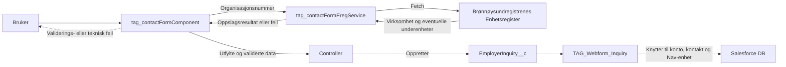

# Kontaktskjema

`tag_contactFormComponent` er et Lightning Web Component (LWC) som viser kontaktskjemaet for arbeidsgivere. Komponenten brukes i Experience Cloud.

Skjemaet samler inn:

- tema for henvendelsen
- organisasjonsnummer og virksomhetsnavn
- eventuell underenhet eller avdeling
- navn, e-postadresse og telefonnummer til kontaktpersonen
- om kontaktpersonen har snakket med en ansattrepresentant når temaet gjelder forebygging av sykefravær

Ved vellykket innsending opprettes en `EmployerInquiry__c` gjennom Apex, og brukeren navigeres til bekreftelsessiden `kontaktskjemabekreftelse`.

## Teknisk løsning

`tag_contactFormComponent` - Hovedkomponent. Skjema, informasjonstekst, feilmeldinger og tilgjengelig struktur.
Tilstand, hendelsesbehandling, validering, innsending og navigering.

`tag_contactFormEregService` - Oppslag mot Enhetsregisteret og underenheter.
Oppslag gjøres på klientsiden (js fetch). Vurderinger for bruk av fetch vs apex callout er dokumentert i teknisk beslutningslogg.

`TAG_ContactFormController` - Henter settings for tema alternativer. Oppretter henvendelsen.

`TAG_ContactForm` -
Model for kontaktskjema

`enhetsregisteret_public_API.cspTrustedSite-meta.xml` -
CSP for Enhetsregisterets API.

Flow `TAG_Webform_Inquiry` - Leser web-felt på henvendelsen og knytter den til konto, kontakt, og Nav enhet. Trigger e-post bekreftelse. Setter diverse forretningsfelt.

## Overordnet dataflyt

## Brukerflyt

1. Temaalternativene hentes fra `TAG_ContactFormController.getThemeOptions` via en cachebar wire-metode.
2. Brukeren velger tema. Alternativet **Forebygge og redusere fravær** viser et ekstra spørsmål om ansattrepresentant.
3. Brukeren skriver inn organisasjonsnummeret. Mellomrom fjernes før validering.
4. Når nummeret består av nøyaktig ni sifre, gjøres et EREG-oppslag etter en forsinkelse på 100 ms. Dette hindrer at det sendes ett kall for hvert tastetrykk.
    - Oppslaget utføres i denne rekkefølgen:
        1. Søk etter organisasjonsnummeret som underenhet.
        2. Hvis det ikke finnes, søk etter nummeret som hovedenhet.
        3. For en hovedenhet hentes underenheter i et separat kall med `size=1000`.
    - Hvis ingen virksomhet finnes, vises meldingen «Fant ingen bedrifter med dette organisasjonsnummeret».
    - Ved vellykket oppslag vises virksomhetsnavnet i en suksessmelding.
5. Hvis virksomheten har mer enn én underenhet, vises en valgfri nedtrekksliste. Standardvalget er hovedenheten.
6. Brukeren fyller inn kontaktopplysninger og velger **Send inn**.
7. Komponenten validerer alle obligatoriske felter. Ved feil vises feltets feilmelding, og fokus flyttes til øverste ugyldige felt.
8. Ved gyldig skjema sendes data til `TAG_ContactFormController.createContactForm`.
9. Etter vellykket opprettelse tømmes komponentens tilstand, og brukeren navigeres til bekreftelsesruten.

## Validering og feilhåndtering

Klientvalideringen skjer når felter endres og på nytt ved innsending.
Serversiden validerer også dataene fordi Apex-metoden kan kalles utenom brukergrensesnittet.
Dersom et validert organisasjonsnummer ikke finnes i SF vil henvendelsen opprettes uten konto/kontakt.
Ved tekniske feil, enten i komponentet eller i oppslag mot Enhetsregister API vises det feilmelding til bruker.

## Testing

Funksjonalitet som bør dekkes i test:

- lasting av temaalternativer
- visning av spørsmålet om ansattrepresentant for riktig tema
- gyldig og ugyldig organisasjonsnummer
- EREG-treff, manglende treff og tjenestefeil
- visning og valg av underenhet
- validering av navn, e-post, telefonnummer og tema
- korrekt payload til `createContactForm`
- toast ved Apex-feil og navigering etter vellykket innsending
